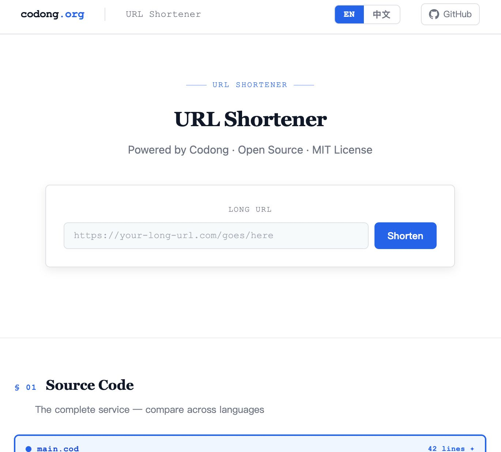

# ShortURL — Built with Codong

> A free, open-source URL shortener. Paste a long link, get a short one instantly. No account required.

**🔗 Live demo → [codong.org/short-url](https://codong.org/short-url/)**



---

## Use it now — no setup needed

Go to **[https://codong.org/short-url/](https://codong.org/short-url/)**, paste your URL, click **Shorten**. Done.

- ✅ Instant short link — `codong.org/s/xxxxxx`
- ✅ 301 redirect — fast, SEO-friendly
- ✅ Click tracking — see how many times your link was visited
- ✅ No login, no account, no rate limit
- ✅ English / 中文 — switch languages in one click

---

## Self-host

### Requirements

- Go 1.22+
- A Linux server (or macOS for local dev)
- nginx (optional, for reverse proxy + HTTPS)

### 1. Clone & Build

```bash
git clone https://github.com/brettinhere/ShortURL-codong
cd ShortURL-codong/cmd
go mod tidy
go build -o shorturl .
```

### 2. Run

```bash
./shorturl
# 2026/03/25 shorturl listening on :8082
```

The SQLite database (`shorturl.db`) is created automatically in the working directory. That's all — the service is running.

### 3. Verify

```bash
# Shorten a URL
curl -X POST http://localhost:8082/api/shorten \
  -H "Content-Type: application/json" \
  -d '{"url": "https://example.com/very/long/path"}'
# → {"code":"abc123","short_url":"https://yourdomain.com/s/abc123"}

# Check stats
curl http://localhost:8082/api/stats/abc123
# → {"code":"abc123","long_url":"...","hits":0,"created_at":"2026-03-25 07:12:46"}

# Redirect works
curl -I http://localhost:8082/s/abc123
# → HTTP/1.1 301 Moved Permanently
# → Location: https://example.com/very/long/path
```

### 4. Keep it running with systemd

```bash
sudo nano /etc/systemd/system/shorturl.service
```

```ini
[Unit]
Description=ShortURL Service
After=network.target

[Service]
Type=simple
WorkingDirectory=/opt/shorturl
ExecStart=/opt/shorturl/shorturl
Restart=always
RestartSec=3

[Install]
WantedBy=multi-user.target
```

```bash
sudo systemctl daemon-reload
sudo systemctl enable --now shorturl
sudo systemctl status shorturl
```

### 5. nginx Reverse Proxy (HTTPS)

```nginx
server {
    server_name yourdomain.com;

    # Frontend
    location /short-url/ {
        alias /path/to/ShortURL-codong/frontend/;
        try_files $uri $uri/ /path/to/ShortURL-codong/frontend/index.html;
    }

    # API
    location /short-url/api/ {
        proxy_pass http://127.0.0.1:8082/api/;
        proxy_set_header Host $host;
        proxy_set_header X-Real-IP $remote_addr;
    }

    # Short link redirect
    location /s/ {
        proxy_pass http://127.0.0.1:8082/s/;
        proxy_set_header Host $host;
        proxy_set_header X-Real-IP $remote_addr;
    }

    # SEO files
    location = /robots.txt  { alias /path/to/ShortURL-codong/frontend/robots.txt; }
    location = /sitemap.xml { alias /path/to/ShortURL-codong/frontend/sitemap.xml; }

    listen 443 ssl;
    # ... your SSL cert config
}
```

Then reload nginx:
```bash
sudo nginx -t && sudo nginx -s reload
```

---

## API Reference

| Method | Path | Description |
|--------|------|-------------|
| `POST` | `/api/shorten` | Create a short link |
| `GET` | `/s/:code` | Redirect to original URL |
| `GET` | `/api/stats/:code` | Get click stats |

**POST `/api/shorten`**
```json
// Request
{ "url": "https://your-long-url.com" }

// Response 200
{ "code": "abc123", "short_url": "https://yourdomain.com/s/abc123" }

// Response 400
{ "error": "invalid url" }
```

**GET `/api/stats/:code`**
```json
{
  "code": "abc123",
  "long_url": "https://your-long-url.com",
  "hits": 42,
  "created_at": "2026-03-25 07:12:46"
}
```

---

## SEO built-in

This project ships with a complete SEO setup — if you self-host, your page is immediately search engine and AI crawler ready:

| Feature | Included |
|---------|----------|
| `<meta>` description, keywords, canonical | ✓ |
| Open Graph tags (social share preview) | ✓ |
| Twitter Card (large image) | ✓ |
| Schema.org `WebApplication` structured data | ✓ |
| Schema.org `SoftwareSourceCode` structured data | ✓ |
| Schema.org `FAQPage` (AI answer boxes) | ✓ |
| `robots.txt` — GPTBot, Claude, Perplexity explicitly allowed | ✓ |
| `sitemap.xml` with hreflang EN / ZH | ✓ |
| OG image (`og-image.svg`) | ✓ |

The `FAQPage` schema means your site can appear directly in AI-powered search results (ChatGPT search, Perplexity, Google AI Overviews) as a structured answer — no extra work needed.

Just update the domain references in `frontend/index.html` from `codong.org` to your own domain and you're done.

---

## Why Codong?

The entire backend service is **42 lines of Codong**. No frameworks. No ORM. No package manager.

```codong
import { generate_id, is_valid_url } from "./lib/url_utils.cod"

db.connect("sqlite://shorturl.db")
db.exec("""
    CREATE TABLE IF NOT EXISTS urls (
        code TEXT PRIMARY KEY,
        long_url TEXT NOT NULL,
        hits INTEGER DEFAULT 0,
        created_at TEXT DEFAULT (datetime('now'))
    )
""")

server = web.serve(port: 8082)

server.post("/api/shorten", fn(req) {
    body = req.json()
    if !is_valid_url(body.url) {
        return {status: 400, body: {error: "invalid url"}}
    }
    code = generate_id(6)
    db.exec("INSERT INTO urls (code, long_url) VALUES (?, ?)", code, body.url)
    return {status: 200, body: {
        code: code,
        short_url: "https://codong.org/s/{code}",
    }}
})

server.get("/s/:code", fn(req) {
    row = db.find_one("SELECT long_url FROM urls WHERE code = ?", req.params.code)
    if row == null {
        return {status: 404, body: {error: "not found"}}
    }
    db.exec("UPDATE urls SET hits = hits + 1 WHERE code = ?", req.params.code)
    return {status: 301, headers: {"Location": row.long_url}}
})

server.get("/api/stats/:code", fn(req) {
    row = db.find_one("SELECT * FROM urls WHERE code = ?", req.params.code)
    if row == null {
        return {status: 404, body: {error: "not found"}}
    }
    return {status: 200, body: row}
})

server.listen()
```

Compare that to other languages:

| Language | Lines | Dependencies |
|----------|-------|--------------|
| **Codong** | **42** | **0** |
| Python (Flask + SQLAlchemy) | ~90 | 2 |
| Go (stdlib) | ~110 | 1 |
| JavaScript (Express) | ~95 | 2 |

Codong has `db` and `web` built in. You write the logic. The language handles the rest.

→ **Learn more: [codong.org](https://codong.org)**

---

## License

MIT
